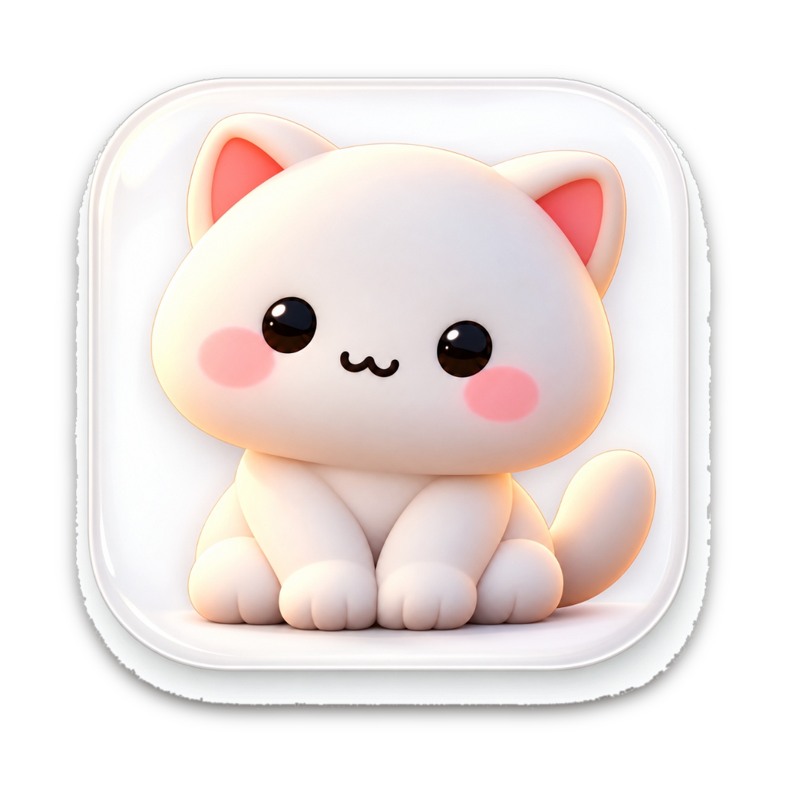
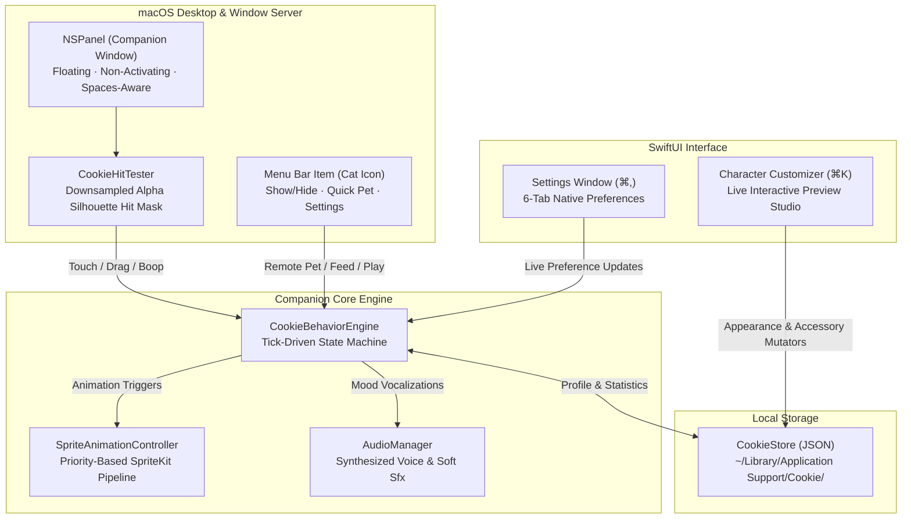
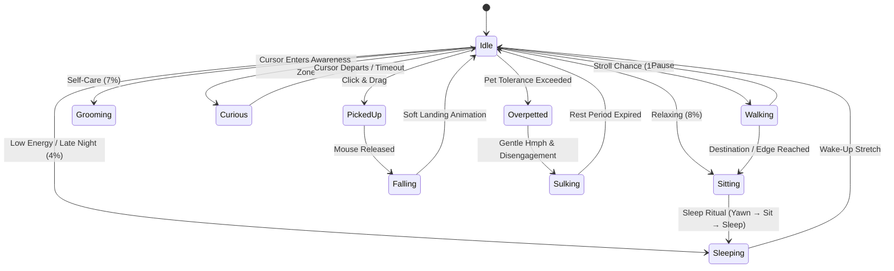
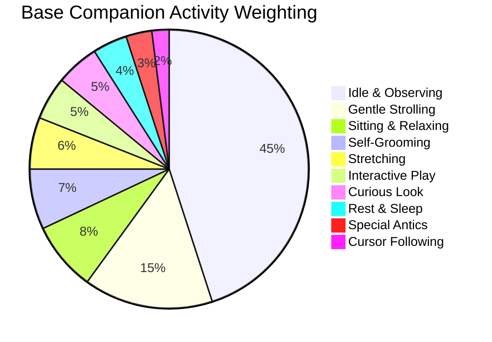

<div align="center">

  

  # Cookie 🐱

  **A quiet, warm 2D desktop companion that lives on your Mac.**  
  *No subscriptions. No cloud accounts. No telemetry. Just a tiny cat right on your desktop.*

  [-262421?style=flat-square&logo=apple&logoColor=white)](https://apple.com)
  [-e87920?style=flat-square)](https://github.com/MdKasif0/Cookie)
  [](https://developer.apple.com/swift/)
  [](LICENSE)
  [](website/#privacy)
  [](https://github.com/MdKasif0/Cookie/releases)

</div>

---

## 📖 Overview

**Cookie** is an authentic, lightweight indie desktop companion designed specifically for macOS. She wanders across your display, follows your cursor with curious glances, naps beside working windows, and purrs when pet.

Built with native **SpriteKit** and **SwiftUI**, Cookie is whisper-quiet on hardware (~0% idle CPU during sleep) and never interrupts your workflow.

---

## ✨ Key Features

| Capability | Detail |
| :--- | :--- |
| **🐾 Living Desktop Companion** | Runs as a borderless, non-activating floating panel across all macOS Spaces without stealing focus. |
| **🎯 Pixel-Perfect Alpha Hit Testing** | Clicks on transparent pixels pass straight through to background apps. Cookie never obstructs your clicks. |
| **🧠 Autonomous Behavior Engine** | Tick-driven state machine shaped by time of day, personality weights, and cooldown timers. |
| **🫳 Direct Tactile Interactions** | Zone-aware petting (nose, head, feet, belly, tail), picking up and dragging, and play bursts. |
| **🎨 Bespoke Customization** | 10 warm fur palettes, custom patterns, eye styles, body scaling, and layered vector accessories. |
| **🎵 Synthesized Sound System** | Pitch-bent cat vocalizations (mrrps, purrs, squeaks, naps) with dedicated volume sliders. |
| **🔒 100% Local & Private** | Zero analytics, zero network requests, and simple JSON persistence in `Application Support`. |

---

## 🏗️ Architecture & Engine

### High-Level System Architecture



### Behavior State Machine

Cookie's behavior is governed by `CookieBehaviorEngine`. Rather than acting like a restless desktop toy, Cookie behaves like a real cat with weighted probabilities, natural durations, and anti-annoyance cooldowns:



### Base Activity Weight Distribution



---

## 🎮 Direct Interactions

Cookie's artwork is mapped into normalized anatomical zones (`CookieZone`) that scale dynamically with sprite variations:

| Zone / Action | Interaction | Reaction & Effect |
| :--- | :--- | :--- |
| **Nose** | Single click | Surprised sneeze or tiny meow. |
| **Head & Ears** | Single click / stroke | Delighted purr, closed-eye grin, and affection gain. |
| **Belly & Body** | Click / rub | Soft meow, happy glance, or contented purr. |
| **Feet** | Single click | Playful hop and quick paw lift. |
| **Tail** | Single click | Gentle startle reaction with twitch. |
| **Pick Up** | Click & Drag | Enters carried pose; stroking mid-air counts as comforting petting. |
| **Drop** | Release cursor | Smooth physics drop with landing cushion sound. |
| **Double Click** | Quick double tap | Short playful burst or enthusiastic jump. |
| **Over-Petting** | Exceeding tolerance | Annoyed look away ("hmph") and a brief sulk avoiding cursor play. |

---

## 🎨 Personalities & Customization

### The Six Personalities

* **😴 Sleepy**: Spends extra time curled up in deep sleep. Ideal for quiet focus sessions.
* **🧶 Playful**: Loves bouncing, double-click games, and inspecting screen elements.
* **💖 Affectionate**: High pet tolerance, frequent purring, and quick affection growth.
* **⚡ Energetic**: Fast strides, active strolls across your workspace, and lively curiosity.
* **👀 Curious**: Follows your cursor closely, tracking movements with gentle head tilts.
* **😼 Grumpy**: Lower pet tolerance, independent behavior, and dry, comical reactions.

### Customization Studio (⌘K)

Accessible directly from the menu bar or settings:
* **Fur Colors**: 10 hand-curated warm swatches (Warm White, Cream, Peach, Ginger, Caramel, Cinnamon, Mocha, Slate, Charcoal, Velvet Black). *Strictly no cold blues or harsh purples.*
* **Patterns**: Solid, Tuxedo, Siamese Points, and Tabby stripes.
* **Eye Styles**: Round, Sleepy, and Sparkle with customized iris glints.
* **Accessories**: Vector-anchored Collars, Bows, Party Hats, Glasses, Scarves, Bandanas, and Crowns.
* **Body Scale**: Classic, Chubby, and Petite options with live panel re-centering.

---

## ⚙️ Native Settings & Menu Bar

Cookie features a clean, native six-tab preference pane (⌘,):

1. **General**: Launch at login (`SMAppService`), initial desktop visibility, and multi-display position recall.
2. **Appearance**: Dynamic scale slider, animation frame rate, and macOS Reduced Motion compliance.
3. **Sound**: Master volume, dedicated meow slider, interaction sound toggles, and ambient purring controls.
4. **Behavior**: Activity cadence (Calm / Balanced / Lively), cursor awareness toggle, and nap duration cap.
5. **Privacy**: Statement of complete local data residency and offline operation.
6. **About**: Version metadata, open-source acknowledgments, and repository links.

---

## 📂 Project Structure

```
Cookie/
├── Cookie/
│   ├── App/             # Entry point, AppDelegate, WindowManager composition
│   ├── Cookie/          # CompanionPanelController, NSPanel, CookieScene (SpriteKit)
│   ├── Behaviors/       # CookieBehaviorEngine, state machine, timers, rituals
│   ├── Animation/       # SpriteAnimationController, texture slicers, frame caches
│   ├── Models/          # CookieProfile, CookieSettings, Personality, Activity
│   ├── Customization/   # Appearance catalogs, vector accessories, pattern generators
│   ├── Audio/           # AudioManager, sound synthesis engine, volume buses
│   ├── MenuBar/         # Status item controller and companion menu
│   ├── Settings/        # Native SwiftUI 6-tab preference panels
│   ├── Views/           # Welcome onboarding window and character studio preview
│   └── Persistence/     # CookieStore (JSON manager with corruption safeguards)
├── scripts/             # Asset generators, sound synthesizer, icon builders
├── website/             # Clean product showcase website & download portal
├── DISTRIBUTION.md      # Code signing, notarization, and DMG build guide
└── project.yml          # Declarative XcodeGen configuration
```

---

## 🚀 Building & Developing

### Requirements
* **macOS 14.0 Sonoma** or later
* **Xcode 15.0+** with Command Line Tools
* **[XcodeGen](https://github.com/yonaskolb/XcodeGen)** (`brew install xcodegen`)

### Quick Start

```bash
# 1. Clone repository
git clone https://github.com/MdKasif0/Cookie.git
cd Cookie

# 2. Generate Xcode project from project.yml
xcodegen generate

# 3. Open in Xcode or build via CLI
open Cookie.xcodeproj
# Or build directly:
xcodebuild -project Cookie.xcodeproj -scheme Cookie -configuration Debug build
```

### Developer CLI Flags

Cookie includes built-in diagnostics for inspecting assets and hit masks:

```bash
# Export all rendered animation frames to /tmp/cookie-frames for visual review
./build/Debug/Cookie.app/Contents/MacOS/Cookie --export-cookie-frames

# Export the pixel-accurate alpha hit-test mask as a debug image
./build/Debug/Cookie.app/Contents/MacOS/Cookie --export-cookie-hitmask
```

---

## 📦 Distribution & Packaging

* **Binary Format**: Universal 2 (`arm64` Apple Silicon + `x86_64` Intel)
* **Installer Format**: Self-contained ~15 MB disk image (`Cookie-1.0.0.dmg`)
* **Local Data Path**: `~/Library/Application Support/Cookie/cookie-store.json`

For complete details on Hardened Runtime, Apple Developer ID signing, and notarization workflows, see [DISTRIBUTION.md](DISTRIBUTION.md).

---

## 📄 License

Cookie is free and open-source software distributed under the **[MIT License](LICENSE)**.

Crafted with care by [Md Kasif Uddin](https://github.com/MdKasif0).
